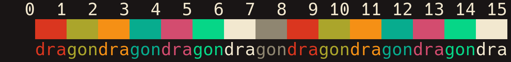

# Coffee Pot

## About It

This repository contains ports of the Coffee Pot theme for terminal emulators. That is a high contrast theme with perfect balance for daily usage.

Here is a preview that you can check it out:



## Installation

### Dependencies

In order to install this software the following dependencies must be installed:

-   `git`: it will be used to clone this repository.

### Procedures

Using a command-line, follow these steps:

-   Clone this repository.

```bash
git clone --depth 1 https://github.com/skippyr/coffee-pot
```

-   Access the repository's directory.

```bash
cd coffee-pot
```

-   Now follow the installation steps for the application that you want to install it on:

<details>
<summary>Kitty</summary>

-   Copy the `kitty/coffee-pot.conf` file to `~/.config/kitty/themes`.

```bash
mkdir -p ~/.config/kitty/themes
cp kitty/coffee-pot.conf ~/.config/kitty/themes
```

-   Add the following include rule in your `~/.config/kitty/kitty.conf` configuration file. Ensure to not include any other theme to avoid causing conflicts:

```bash
include themes/coffee-pot.conf
```

- Open a new Kitty window.

</details>

<details>
<summary>Alacritty</summary>

-   Copy the `alacritty/coffee-pot.yml` file to `~/.config/alacritty/themes`.

```bash
mkdir -p ~/.config/alacritty/themes
cp alacritty/coffee-pot.yml ~/.config/alacritty/themes
```

-   Add the following import rule to your `~/.config/alacritty/alacritty.yml` configuration file. Ensure to not import any other theme to avoid conflicts:

> [!IMPORTANT]
>
> This configuration file must be indented using 2 spaces. Using other indentation style will result in a parse error.

```bash
import:
  - ~/.config/alacritty/themes/coffee-pot.yml
```

-   Open a new Alacritty window.

</details>

## Issues And Contributions

You can use its [issues page](https://github.com/skippyr/coffee-pot/issues) to provide your feedback, give suggestions and to ask for help to solve issues.

You can also fork it and send pull requests to be reviewed.

All kinds of contributions, from people of any skill level, is always appreciated.

## Copyright

This software is distributed under the BSD-3-Clause license. A copy of its license is bundled with the source code as the file `LICENSE` in the root directory of this repository.

Copyright (c) 2023 Sherman Rofeman. BSD-3-Clause license.